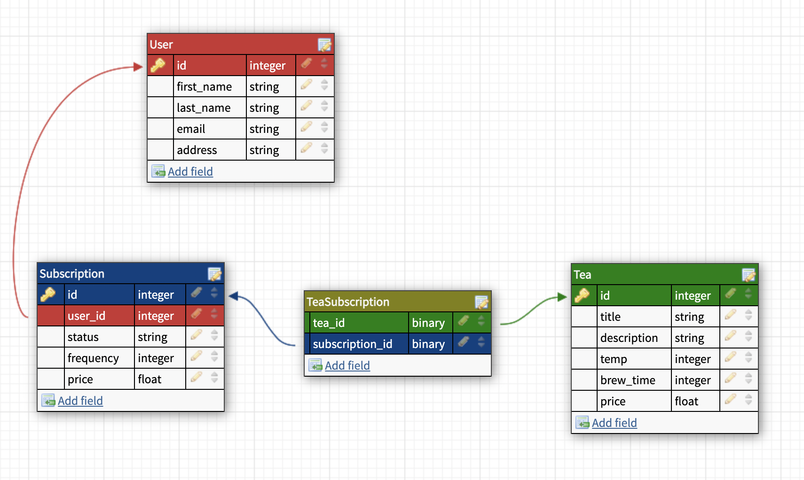

# **Tea Anyone?**


 <!-- ALL-CONTRIBUTORS-BADGE:START - Do not remove or modify this section -->
<!-- ALL-CONTRIBUTORS-BADGE:END -->


## **Table of Contents**
- [Background and Description](#background-and-description)
- [Schema](#schema)
- [Goals](#goals)
- [Requirements and Setup (for Mac):](#requirements-and-setup-for-mac)
    - [Ruby and Rails Versions](#ruby-and-rails-versions)
    - [Gems Utilized](#gems-utilized)
    - [SetUp](#setup)
- [Endpoints](#endpoints-provided)
- [Contributors](#contributors-)

## **Background and Description**

This app exposes three different endpoints to an imaginary Front End which allows users to create and cancel tea subscriptions, as well as return all user subscriptions

## **Schema**


## **Goals**

- Expose an API that creates and cancels user tea subscriptions, as well as returns all subscriptions for a given user


## **Requirements and Setup (for Mac):**

### **Ruby and Rails Versions**
- Ruby Version 2.7.4
- Rails Version 5.2.8

### **Gems Utilized**
- [capybara](https://github.com/teamcapybara/capybara)
- [pry](https://github.com/pry/pry)
- [rspec_junit_formatter](https://github.com/sj26/rspec_junit_formatter)
- [rspec](https://relishapp.com/rspec)
- [shoulda-matchers](https://github.com/thoughtbot/shoulda-matchers)
- [securerandom](https://github.com/ruby/securerandom)
- [simplecov](https://github.com/simplecov-ruby/simplecov)
- [activerecord-reset-pk-sequence](https://github.com/splendeo/activerecord-reset-pk-sequence)

## Setup
1. Clone this repository:
On your local machine open a terminal session and enter the following commands for SSH or HTTPS to clone the repositiory.


- using ssh key <br>
```shell
$ git clone git@github.com:johnny-bowman/tea_anyone.git
```

- using https <br>
```shell
$ git clone https://github.com/johnny-bowman/tea_anyone.git
```

Once cloned, you'll have a new local copy in the directory you ran the clone command in.

2. Change to the project directory:<br>
In terminal, use `$cd` to navigate to the backend Application project directory.

```shell
$ cd tea_anyone
```

3. Install required Gems utilizing Bundler: <br>
In terminal, use Bundler to install any missing Gems. If Bundler is not installed, first run the following command.

```shell
$ gem install bundler
```

If Bundler is already installed or after it has been installed, run the following command.

```shell
$ bundle install
```

* There should be be verbose text diplayed of the installation process that looks similar to below. (this is not an actual copy of what will be output).

<details>
<summary><b>Click to see example!</b></summary>
<p>

```shell
$ bundle install
Fetching gem metadata from https://rubygems.org/...........
Fetching gem metadata from https://rubygems.org/.
Resolving dependencies...
Using rake 13.0.6
Using concurrent-ruby 1.1.10
...
...
...
Using simplecov_json_formatter 0.1.4
Using simplecov 0.21.2
Using spring 2.1.1
Using spring-watcher-listen 2.0.1
Using standard 1.12.1
Bundle complete! 23 Gemfile dependencies, 94 gems now installed.
Use `bundle info [gemname]` to see where a bundled gem is installed.
```

</p>
</details></br>

* If there are any errors, verify that bundler, Rails, and your ruby environment are correctly setup.

5. Database Migration & Seed<br>
Before using the web application you will need to setup your databases locally by running the following command

```shell
$ rails db:{:drop,:create,:migrate,:seed}
```
6. Startup and Access<br>
Finally, in order to use the web app you will have to start the server locally.
- Start server

```shell
$ rails s
```

At this point you should be able to access the endpoints with postman.

## Endpoints provided

<details>
<summary><b>Click to see example!</b></summary>
<p>

```sh
                Prefix Verb URI Pattern                                         Controller#Action
api_v1_subscription_index POST   /api/v1/subscription(.:format)              api/v1/subscription#create
      api_v1_subscription PATCH  /api/v1/subscription/:id(.:format)          api/v1/subscription#update
                   api_v1 GET    /api/v1/users/:id/subscriptions(.:format)   api/v1/user_subscription#index
```

</p>
</details></br>

## **Contributors**


<!-- ALL-CONTRIBUTORS-LIST:START - Do not remove or modify this section -->
<!-- prettier-ignore-start -->
<!-- markdownlint-disable -->
<table>

  <tr>

   <td align="center"><a href="https://github.com/johnny-bowman"><br /><sub><b>Johnny Bowman (he/him)</b></sub></a><br /><a href="https://www.linkedin.com/in/johnnybowmansoftware/" title ="Linked In"></a><br>

  </tr>
</table>

<!-- markdownlint-restore -->
<!-- prettier-ignore-end -->

<!-- ALL-CONTRIBUTORS-LIST:END -->

This project follows the [all-contributors](https://github.com/all-contributors/all-contributors) specification.
<!--
© 2022 GitHub, Inc.
Terms
Privacy
Security
Status
Docs
Contact GitHub
Pricing
API
Training
Blog
About
